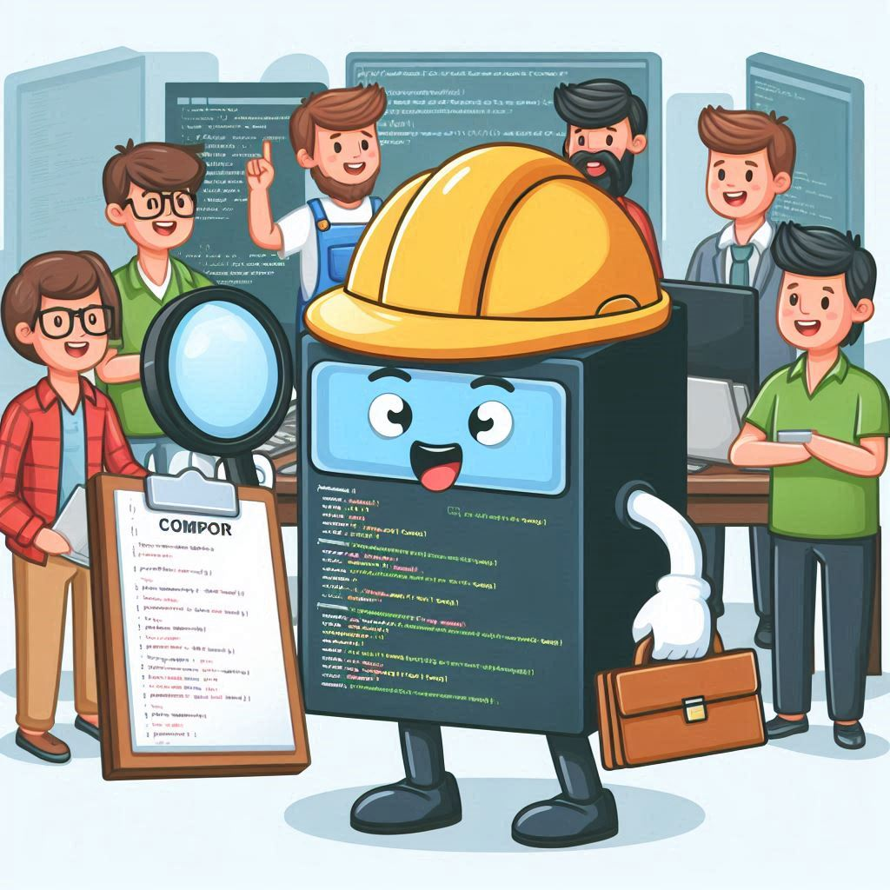
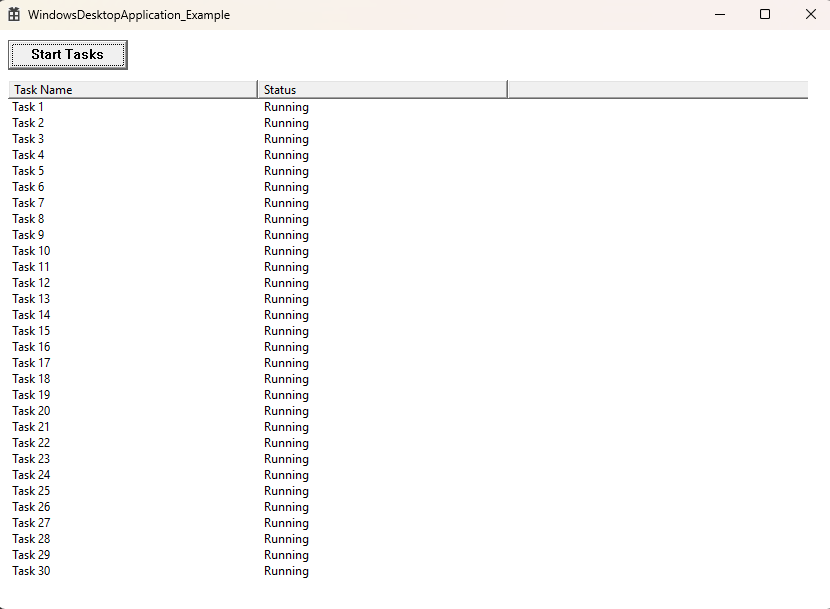
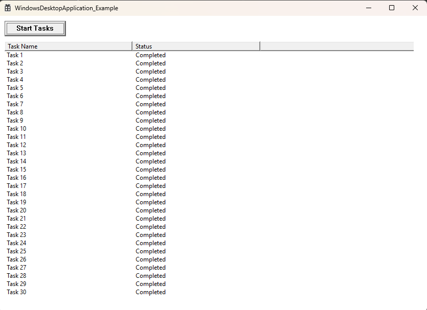

# SafeJobSystem - Cross-platform C++20 Job System Library


GPT-4


SafeJobSystem is a cross-platform library designed for creating and managing Multi-Threaded Job Systems across multiple platforms. It abstracts platform-specific Job System management code into a unified interface, allowing you to create and manipulate Job-Systems in a platform-agnostic way. 


### Thread Safety - Anti-Thread Lock - Lock Free Queue

#### Advanced Concurrency Techniques

Characteristics:

- Lock-Free Queues: Implementations like Michael-Scott queues use atomic operations to avoid locking, reducing contention.
- Work-Stealing: More complex but improves load balancing across threads.
- Thread Pools: Advanced management of thread lifecycles and task distribution.

Pros:

- High Performance: Designed for scenarios with high contention and frequent access.
- Efficient Utilization: Better at handling high concurrency with reduced latency and overhead.

Cons:

- Complexity: More complex to implement and understand due to low-level atomic operations and intricate logic.
- Debugging: Harder to debug and maintain due to the complexity of lock-free algorithms.
Choosing the Right Approach
- For Simple Applications: If your application does not require extremely high concurrency and performance, the simpler implementation using mutexes and condition variables might be sufficient.
- For High-Performance Needs: If you need to maximize performance and handle high concurrency, investing in lock-free queues and advanced techniques might be worth the complexity.
- In summary, the simpler implementation is often a good starting point, especially for less demanding applications or when developing a proof of concept. For production-grade systems where performance is critical, exploring advanced concurrency techniques can provide significant benefits, but this comes at the cost of increased complexity.


## Features


- Cross-platform support for Windows, macOS, Linux, Android, iOS, WebAssembly, PS5, Xbox, and a No-op/Console mode. (currently)
- SafeJobSystem Creation and Management.
- Namespace 'SafeJobSystem' Prevents Global Code Leaks
- C++20 and Zero Dependancy Design


## Tested


- Tested in Windows 10/11 With Console and WindowsDesktopApplication.








```cpp


## Supported Platforms

- **Windows** (Win32)
- **macOS** (Cocoa)
- **Linux** (XCB or XLib)
- **Android**
- **iOS** (UIKit)
- **WebAssembly** (Emscripten)
- **PlayStation 5** (PS5)
- **Xbox**
- **No-op** (Headless mode)
```


## Installation

### Prerequisites

- C++20 or later
- CMake 3.10 or later

### Building

1. Clone the repository:
```sh
   git clone https://github.com/Autodidac/SafeJobSystem.git
   cd SafeJobSystem
```


### Build using WIN32 (Windows 11 64bit) and vs2022:
Simply run the provided vs solution file `SafeJobSystem.sln` in the main folder


### Generate build files using CMake:
Run cmake to generate the build files, then compile:


### Build the project:
Basic Build:
```sh
mkdir build
cd build
cmake ..
cmake --build .
```


Run:

After building, you can run the generated executable. If you built with headless mode, the console window will be allocated as needed.


### Usage
##### Example Console Batch
```batch
@echo off
WindowsDesktopApplication_Example.exe 
pause
```

##### Example
```cpp
#include "SafeJobSystem.h"

int main() {

    return 0;
}
```

### Example Implementation (for Win32)
```cpp
#include "SafeJobSystem.h"  // Platform-specific include

```

### API Reference

```cpp

```


### Platform-specific Implementations
The platform-specific implementation files are organized into separate source files. Each implementation file contains the initialization, window creation, and shutdown code for a specific platform.

-Windows:

-macOS:

-Linux: 

-Android:

-iOS: 

-WebAssembly: 

-PlayStation 5: 

-Xbox: 

-No-op mode:


### License
This project is licensed under the MIT License. See the LICENSE file for details.


### Contributing
Contributions are welcome! Please see the CONTRIBUTING.md file for guidelines.


## Acknowledgements
This project was developed with the support of OpenAI's GPT-4, which provided valuable assistance in generating code and design ideas. We appreciate the power and capabilities of GPT-4 in aiding the creation of this project.


SafeJobSystem - A GPT4 Crossplatform Library For All! Almost Entirely Built and Designed by AI - Even much of this readme and the CMakeLists.txt are written by GPT-4.. what a wonderful tool Thank You Again!


